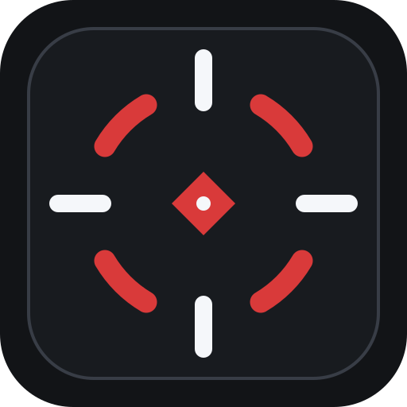

<p align="center">
  
</p>

# Rain-Crosshair

A small crosshair overlay for Windows. It draws a crosshair in the middle of your screen, on top of everything else, and your clicks pass straight through it.

You design the crosshair in the app, save as many as you want, and switch between them with a hotkey. When you're not editing, it sits in the tray and stays out of the way.

<!-- Add a screenshot of the editor here, for example:  -->

## Install

1. Download `Rain-Crosshair-Setup-x.x.x.exe` from the [latest release](https://github.com/AslamChahban/rain-crosshair/releases/latest).
2. Run it and click through the installer.

Windows 10 and 11 only.

Windows will probably show a SmartScreen warning about an unknown publisher. The installer isn't code-signed yet (certificates cost money), so Windows has never seen it before. If you want to check that your download is the real one, compare its hash with `SHA256SUMS.txt` from the same release:

```powershell
Get-FileHash .\Rain-Crosshair-Setup-x.x.x.exe -Algorithm SHA256
```

Please don't turn off Defender or your antivirus to install it. A SmartScreen warning is only about reputation. If your antivirus reports a specific detection by name, that's a different thing: don't run the file and open an issue.

## Using it

Open the app, pick a preset or start from scratch, and move the sliders until it looks right. The preview in the app and the overlay on your screen both update as you change things. Press Save to keep it.

Closing the window doesn't quit Rain-Crosshair. It keeps running in the tray so the overlay and hotkeys still work. To close it properly, right-click the tray icon and choose Quit.

### Hotkeys

| Action | Default |
| --- | --- |
| Show or hide the crosshair | `F6` |
| Next profile | `F7` |
| Previous profile | `F8` |
| Open or hide the app window | `Ctrl + F6` |

You can change all of these on the Keybinds page.

### What you can change

Line length (horizontal and vertical separately), thickness, gap, rounded line ends, color and opacity, an outline, a center dot (round or square), a ring, rotation, and a pixel offset. Each of the four arms can be switched off on its own, so a T shape or a plain dot is just a setting. There are a few presets to start from if you don't want to build one yourself.

You can also pick which monitor the crosshair shows up on, have the app start with Windows, and have it start minimized.

### Sharing crosshairs

The Share button copies your current crosshair as a short code that starts with `RAIN1:`. To use someone else's, paste their code into Share / Import on the Options page. Codes are checked when you import them, so a broken or edited one gets rejected instead of messing up your profiles.

## Games and overlays

The crosshair is a separate transparent window drawn on top of your screen. It doesn't read game memory, inject anything into a game, or touch game files, and it has no effect on recoil or accuracy. It's only a drawing.

Because of that, it can't draw over exclusive fullscreen. Run your game in borderless or windowed fullscreen. A few protected apps and Windows secure screens won't show it either.

I can't speak for any game's anti-cheat or rules. If you play something competitive, check whether overlays are allowed before you rely on this.

## Updates

Rain-Crosshair checks GitHub Releases when it starts and every few hours after that. If there's a newer version you'll see a banner in the app: download it, then restart to install. You can also check by hand on the Options page.

## Troubleshooting

**The crosshair doesn't show in my game.** Switch the game to borderless or windowed fullscreen. Overlays can't appear over exclusive fullscreen.

**A hotkey does nothing.** Another program may already be using that key. Pick a different one on the Keybinds page.

**The crosshair isn't exactly centered.** It's placed at the exact center of the monitor you chose, not the center of the game window. If your game window isn't centered on that monitor, use the offset sliders on the Position & Size page.

**The overlay flickers or looks wrong on my PC.** The app turns off hardware acceleration to save memory. Some GPU and driver combinations don't like that. Right-click your Rain-Crosshair shortcut, open Properties, and add ` --enable-gpu` to the end of the Target field.

## Building from source

<details>
<summary>For developers</summary>

&nbsp;

You need Windows 10 or 11, Node.js 20 or newer, and npm.

```powershell
npm install
npm start          # run the app
npm test           # unit tests
npm run test:e2e   # opens real windows for a few seconds
npm run dist       # build the installer into release/
```

Releases are built by GitHub Actions when you push a version tag, for example `v0.7.8`. The tag has to match the `version` in `package.json`. The workflow runs the tests, builds the installer, creates `SHA256SUMS.txt`, and uploads everything to the release, including `latest.yml` and the `.blockmap` file that the auto-updater needs.

Editing files in the repo doesn't update anyone's installed copy. Installed apps only see a new version when you publish a release with a higher version number.

</details>

## License

MIT
